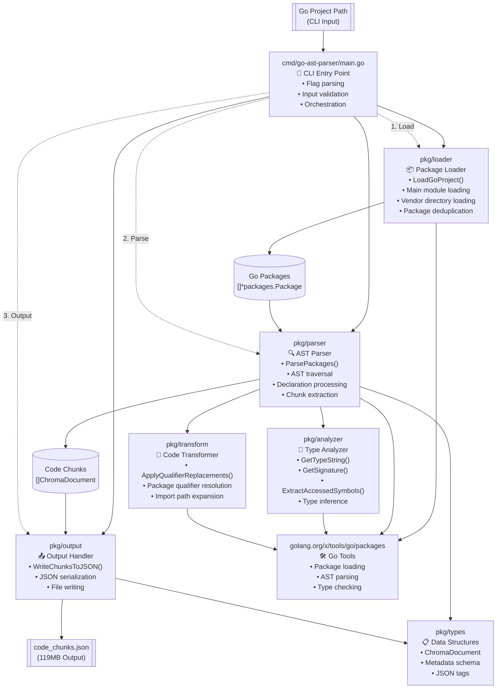

# Go AST Parser - Architecture Documentation

## 📋 Executive Summary

The Go AST Parser is a modular command-line tool that analyzes Go projects and extracts structured code chunks for code indexing, search, and static analysis. It processes both main module and vendor dependencies, generating comprehensive metadata about functions, types, and symbols for exact code search and navigation.


**Processing Pipeline:** Load → Parse → Analyze → Transform → Output
**Languages:** Pure Go with go/ast and golang.org/x/tools

---

## 🏗️ System Architecture

### Core Components

| Package | Responsibility | Key Functions |
|---------|---------------|---------------|
| `cmd/go-ast-parser` | CLI Entry Point | Flag parsing, input validation, orchestration |
| `pkg/loader` | Package Loading | LoadGoProject(), vendor + main module loading |
| `pkg/parser` | AST Parsing | ParsePackages(), declaration processing |
| `pkg/analyzer` | Type Analysis | GetTypeString(), ExtractAccessedSymbols() |
| `pkg/transform` | Code Transformation | ApplyQualifierReplacements() |
| `pkg/output` | Output Handling | WriteChunksToJSON() |
| `pkg/types` | Data Structures | ChromaDocument struct |

### Architecture Diagram



---

## 🔄 Processing Pipeline

### Data Flow Diagram

```mermaid
flowchart TD
    START([🚀 Start: go-ast-parser -path /project])
    
    %% Input Validation
    VALIDATE{{"🔍 Validate Input<br/>• Path exists?<br/>• go.mod exists?"}}
    ERROR_EXIT[("❌ Exit with Error")]
    
    %% Step 1: Package Loading
    LOAD_MAIN["📦 Load Main Module<br/>packages.Load('./...')<br/>from project root"]
    LOAD_VENDOR["📦 Load Vendor Packages<br/>packages.Load('./...')<br/>from vendor directory"]
    DEDUPE["🔄 Deduplicate Packages<br/>Remove duplicate IDs<br/>Merge package lists"]
    
    %% Step 2: AST Processing  
    PROCESS_PKG["🔍 Process Each Package<br/>• Validate TypesInfo<br/>• Check Syntax trees<br/>• Verify Fset"]
    
    PROCESS_FILE["📄 Process Each File<br/>• Read source code<br/>• Check if vendored<br/>• Extract file metadata"]
    
    PROCESS_DECL["📋 Process Each Declaration<br/>• Function declarations<br/>• Type declarations<br/>• Value declarations"]
    
    %% Analysis & Transformation
    ANALYZE["🧠 Analyze Declaration<br/>• Extract type information<br/>• Get function signatures<br/>• Find accessed symbols"]
    
    TRANSFORM_CODE["🔄 Transform Code<br/>• Replace package qualifiers<br/>• Expand import paths<br/>• Apply transformations"]
    
    CREATE_CHUNK["📝 Create Chunk<br/>• Generate unique ID<br/>• Package metadata<br/>• Create ChromaDocument"]
    
    %% Step 3: Output
    COLLECT["📊 Collect All Chunks<br/>Aggregate from all<br/>packages and files"]
    
    SERIALIZE["📤 Serialize to JSON<br/>json.MarshalIndent<br/>Pretty formatting"]
    
    WRITE_FILE["💾 Write to File<br/>code_chunks.json<br/>(119MB output)"]
    
    SUCCESS([✅ Success: Chunks Extracted])
    
    %% Connections
    START --> VALIDATE
    VALIDATE -->|Valid| LOAD_MAIN
    VALIDATE -->|Invalid| ERROR_EXIT
    
    LOAD_MAIN --> LOAD_VENDOR
    LOAD_VENDOR --> DEDUPE
    
    DEDUPE --> PROCESS_PKG
    PROCESS_PKG --> PROCESS_FILE
    PROCESS_FILE --> PROCESS_DECL
    
    PROCESS_DECL --> ANALYZE
    ANALYZE --> TRANSFORM_CODE
    TRANSFORM_CODE --> CREATE_CHUNK
    
    CREATE_CHUNK --> COLLECT
    COLLECT --> SERIALIZE
    SERIALIZE --> WRITE_FILE
    WRITE_FILE --> SUCCESS
```



---

## 📊 Data Structures

### ChromaDocument Schema
```json
{
  "id": "file_path:line_start-line_end-entity_name",
  "document": "actual_code_content",
  "metadata": {
    "file_path": "/path/to/file.go",
    "package_name": "main",
    "is_vendored": false,
    "accessed_symbols": ["package.Symbol"],
    "entity_type": "function|method",
    "entity_name": "FunctionName",
    "declaration_kind": "type|const|var",
    "type": "string|int|CustomType",
    "receiver_type": "ReceiverType" // for methods only
  }
}
```

---

## 🚀 Usage & Build Instructions

### Building the Project
```bash
# Build using Makefile
make build

# Manual build
go build -o bin/go-ast-parser ./cmd/go-ast-parser
```

### Running the Tool
```bash
# Analyze a Go project
./bin/go-ast-parser -path /path/to/go/project

# Output: code_chunks.json (119MB)
```

---

## ✅ Architecture Benefits

### 🎯 **Design Principles Achieved:**
- **Separation of Concerns** - Each package has a single responsibility
- **Modularity** - Clean package boundaries with well-defined interfaces
- **Testability** - Each component can be unit tested independently
- **Maintainability** - Easy to modify or extend individual components
- **Scalability** - Can process large codebases efficiently

### 🔧 **Technical Advantages:**
- **Memory Efficient** - Streaming processing of large codebases
- **Type Safe** - Leverages Go's type system for reliable analysis
- **Comprehensive** - Analyzes both main module and vendor dependencies
- **Extensible** - Easy to add new analysis features
- **Standard Compliant** - Uses official Go AST and type checking tools

### 📈 **Performance Characteristics:**
- **Input Processing** - Handles projects with thousands of files
- **Output Generation** - Produces structured 119MB JSON output
- **Memory Usage** - Efficient deduplication and streaming
- **Build Time** - Fast compilation with optimized dependencies

---


## 📝 Implementation Notes

### Key Design Decisions:
- **Vendor Inclusion** - Processes both main and vendor code for completeness
- **Metadata Richness** - Comprehensive symbol and type information
- **Unique IDs** - File path + line range + entity name for chunk identification
- **JSON Output** - Human-readable format for easy integration
- **Modular Architecture** - Package-based organization for maintainability

### Dependencies:
- **golang.org/x/tools/go/packages** - Official Go package loading
- **Standard Library** - go/ast, go/token, go/types for AST processing
- **No External Runtime Dependencies** - Self-contained binary

---

*Module: github.com/sunku5494/go-ast-parser*
*Version: 1.0.0* 